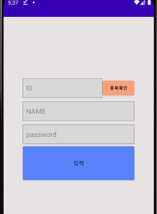
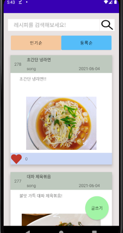
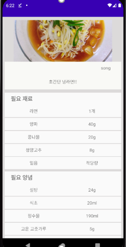
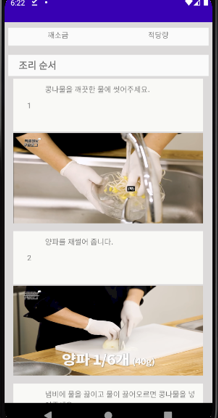
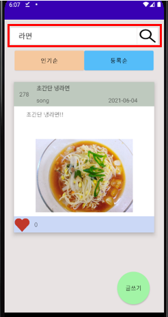
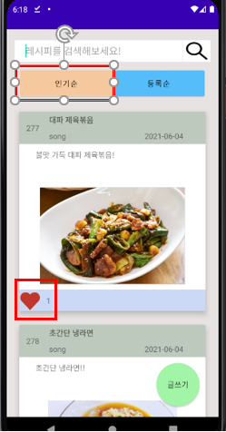
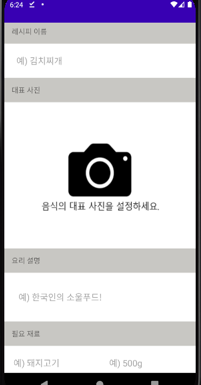
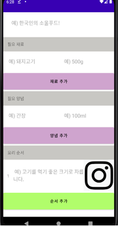

## used

|                                                                       Java                                                                       |                                          Android                                          |                                           Php                                            |                                                Aws ec2                                                |                                                                       MySQL                                                                       |     
|:------------------------------------------------------------------------------------------------------------------------------------------------:|:---------------------------------------------------------------------------------------------:|:----------------------------------------------------------------------------------------------------:|:-------------------------------------------------------------------------------------------------------------:|:-------------------------------------------------------------------------------------------------------------------------------------------------:|
| 

 |  |  |  | 

 |     

## 구현

- 로그인 
  
- 회원가입 
  
- 사용자들의 레시피 조회 
  
- 레시피 상세 조회 
  
- 레시피 및 조리법 조회 
  
- 레시피 검색 
  
- 레시피 정렬 및 좋아요 
  
- 레시피 등록 
  
- 레시피 등록 
    

